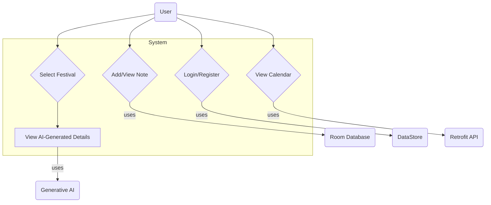

# Project: MyCalendar App (AI-Enhanced Nepali Calendar)

## 1. Project Title

**MyCalendar App** — An AI-Enhanced Nepali Calendar Application.

## 2. Problem Description

For Nepali communities worldwide, keeping track of the Bikram Sambat (BS) calendar, including important dates, festivals, and cultural events, can be challenging with standard Gregorian calendar apps. Existing solutions often lack modern features, intuitive design, or detailed cultural context for these events.

MyCalendar App solves this by providing a clean, modern, and feature-rich mobile calendar focused on the Nepali date system. It serves as a daily utility for users to track dates, view upcoming festivals, and manage personal notes. By integrating Generative AI, it goes a step further, offering rich, dynamically generated descriptions and images for festivals, helping users connect more deeply with their cultural heritage.

**Target Users:**

- Nepali individuals and families living in Nepal and abroad.
- Anyone interested in Nepali culture and its calendar system.

## 3. Features Overview

- **Full Calendar View:** Displays a full month view of the Bikram Sambat calendar, showing corresponding Gregorian (AD) dates.
- **Festival & Holiday Information:** Highlights festivals and public holidays directly on the calendar.
- **AI-Powered Festival Details:** On selecting a festival, the app uses Generative AI to provide a detailed description of its significance and rituals, along with a unique, AI-generated image representing the event.
- **User Authentication:** A simple, device-specific login/registration system to personalize user experience.
- **Personal Notes (CRUD):** Users can add, view, and manage personal notes or reminders for any date on the calendar.
- **Background Sync & Notifications:** A `WorkManager` job runs periodically to sync data and can be extended to provide notifications for upcoming festivals.
- **Modern UI:** Built entirely with Jetpack Compose and Material 3, providing a clean and responsive user experience.
- **Single-Activity Architecture:** Uses the `Navigation 3` library to manage all screens within a single activity, ensuring a seamless navigation flow.

## 4. System Architecture

The application is built using **Clean Architecture** principles to ensure a separation of concerns, making the codebase scalable, maintainable, and testable. The architecture is divided into three main layers:

- **Presentation Layer:** Contains all UI-related components, built with Jetpack Compose. This layer includes ViewModels (`CalendarViewModel`, `FestivalDetailViewModel`, etc.) which manage the UI state and handle user interactions. It observes data from the Domain layer.
- **Domain Layer:** This is the core of the application, containing the business logic and rules. It defines repository interfaces (`FestivalRepository`, `NotesRepository`, etc.) that abstract the data sources. It is completely independent of Android framework dependencies.
- **Data Layer:** Implements the repository interfaces defined in the Domain layer. It is responsible for managing all data, whether from a remote server (Retrofit, Firebase AI) or local storage (Room Database, DataStore).

### Architecture Diagram

```
+----------------------------------------------------------------+
|                       Presentation Layer                       |
| (Jetpack Compose, ViewModels, Navigation 3)                    |
+---------------------------------^------------------------------+
                                  | (Observes State)
                                  |
+---------------------------------V------------------------------+
|                         Domain Layer                           |
| (Repository Interfaces, Business Models)                       |
+---------------------------------^------------------------------+
                                  | (Depends on Interfaces)
                                  |
+---------------------------------V------------------------------+
|                           Data Layer                           |
| (Repository Implementations, Room, Retrofit, DataStore, GenAI) |
+----------------------------------------------------------------+
```

## 5. Use Case Diagram

This diagram illustrates the main interactions a user can have with the system.



## 6. Technology Stack

| Component             | Technology                                                                           |
| --------------------- | ------------------------------------------------------------------------------------ |
| **UI**                | Jetpack Compose, Material 3, Material Icons                                          |
| **Architecture**      | Clean Architecture (Data, Domain, Presentation layers), MVVM                         |
| **Asynchronous**      | Kotlin Coroutines & Flow                                                             |
| **Navigation**        | Navigation 3 (Type-safe, single-activity)                                            |
| **Local Persistence** | **Room** (for user notes), **DataStore** (for user login credentials)                |
| **Remote Data**       | **Retrofit** (for calendar data), **OkHttp** (logging)                               |
| **Generative AI**     | **Firebase AI** (Gemini for text, Imagen for images)                                 |
| **Backend**           | **Node.js**, **Express**, **Axios**, **JSDOM** (for web scrapping)                   |
| **Background Tasks**  | **WorkManager** (for periodic data sync/notifications)                               |
| **Testing**           | **JUnit 4**, **Robolectric**, **kotlinx-coroutines-test** (for ViewModel unit tests) |
| **Serialization**     | **Gson**, **kotlinx.serialization**                                                  |

## 7. Package Hierarchy

The project structure clearly reflects the Clean Architecture layers.

```
com.example.mycalendar
├── core/
│   ├── ai/               # AI model services
│   ├── database/         # Room Database setup (entities, DAOs)
│   └── dispatcher/       # Coroutine dispatchers provider
├── data/
│   ├── local/
│   ├── remote/              # DataStore implementation
│   └── repository/       # Implementations of domain repositories
├── domain/
│   ├── model/            # Core data models (e.g., UserCredentials)
│   └── repository/       # Repository interfaces
├── navigation/
│   └── (AppNavGraph.kt, AppNavKey.kt)  # Navigation 3 setup
├── presentation/
│   ├── ui/               # Composable screens
│   ├── uistate/          # UI state data classes
│   ├── viewmodel/        # ViewModels for each screen
│   └── worker/           # WorkManager implementation
└── ui/
    └── theme/            # Compose theme
```

## 8. Screenshots / Screen Flow

    (Screenshots are provided on seperate MyCalendarAppScreenshots pdf)

**Screen Flow:**

1.  **Calendar Screen:** The app opens to the main calendar view, showing the current Bikram Sambat month. Users can navigate between months.
2.  **Festival Detail:** Tapping on a day with a festival navigates to the `FestivalDetailScreen`, where AI-generated text and images are displayed.
3.  **User Login:** From the "Info" tab, a user can log in or register. This allows them to add personal notes.
4.  **Add Note:** A long-press on a calendar day (while logged in) opens a dialog to add a personal note for that date.

## 9. Setup Instructions

1.  **Clone the Repository:**
    ```bash
    git clone https://github.com/sandeshshahi/MobileDevFinalProj
    ```
2.  **Firebase Setup:**
    - This project uses Firebase for Generative AI. To connect it to your own Firebase project, you will need to:
    - Go to the [Firebase Console](https://console.firebase.google.com/) and create a new Android project.
    - Download the `google-services.json` file from your Firebase project settings.
    - Place the `google-services.json` file in the `app/` directory of this project.
3.  **Run the Backend Server:**
    - The calendar data is fetched from a Node.js server that scrapes the data from a website.
    - Navigate to the `nepali-calendar-api (backend)` directory in the project.
    - Install the dependencies: `npm install`
    - Start the server: `npm start`
    - The server will be running at `http://localhost:3000`.
4.  **Open in Android Studio:**
    - Open the cloned repository in a recent version of Android Studio.
    - Let Gradle sync the project dependencies.
5.  **Run the App:**
    - Build and run the app on an emulator or a physical device.

## 10. API Reference

- **Calendar Data API (Node.js Server):**

  - **Base URL:** `http://10.0.2.2:3000/` (Note: `10.0.2.2` is the standard alias for the host machine's localhost from the Android emulator).
  - **Endpoint:** `GET /api/scrape`
  - **Query Params:** `year: Int`, `month: Int`
  - **Description:** Scrapes and returns the calendar data for a specific Bikram Sambat month and year.

- **Generative AI API (Firebase AI):**
  - **Text Model:** `gemini-2.5-flash-preview-0514` (via `GenerativeModel`)
  - **Image Model:** `imagen-3` (via `ImagenModel`)
  - **Description:** These services are used to generate contextual descriptions and images for festivals.

## 11. Data Models

- **Room Entity (`Note.kt`):** Represents a user's personal note for a specific date.
  ```kotlin
  @Entity(tableName = "notes")
  data class Note(
      @PrimaryKey(autoGenerate = true) val id: Long = 0,
      val username: String,
      val bsMonth: String,
      val bsDate: String,
      val enDate: String,
      val text: String,
      val created: Long = System.currentTimeMillis()
  )
  ```
- **UI State DTO (`CalendarUiState.kt`):** Represents a single day cell in the calendar grid.
  ```kotlin
  data class CalendarDay(
      val adDate: String,
      val bsDate: String,
      val isToday: Boolean,
      val isCurrentMonth: Boolean,
      val festivalName: String? = null,
      val isHoliday: Boolean = false
  )
  ```

## 12. Testing (ViewModel Unit Test)

Unit tests are implemented for ViewModels to ensure the business logic and state updates work as expected. Tests use a `FakeRepository` to isolate the ViewModel from the data layer and `kotlinx-coroutines-test` for handling asynchronous operations.

Here is an example test for the `FestivalDetailViewModel`:

```kotlin
// In app/src/test/java/com/example/mycalendar/ui/test/FestivalDetailViewModelTest.kt

@OptIn(ExperimentalCoroutinesApi::class)
@RunWith(RobolectricTestRunner::class)
@Config(sdk = [34], application = TestApp::class, manifest = Config.NONE)
class FestivalDetailViewModelTest {
    private lateinit var testDispatcher: TestDispatcher
    private lateinit var fakeRepo: FakeFestivalRepository

    @Before
    fun setup() {
        testDispatcher = StandardTestDispatcher()
        Dispatchers.setMain(testDispatcher)
        fakeRepo = FakeFestivalRepository()
    }

    @After
    fun tearDown() {
        Dispatchers.resetMain()
    }

    private fun onePxBitmap(): Bitmap = Bitmap.createBitmap(1, 1, Bitmap.Config.ARGB_8888)

    @Test
    fun `when repository returns success uiState contains description, image and no error`() = runTest {
        fakeRepo.textResponse = Result.success("Fake festival description")
        fakeRepo.imageResponse = Result.success(listOf(onePxBitmap()))

        val vm = FestivalDetailViewModel(
            festivalName = "भाइटीका\nBrother-Sister Tika",
            bsMonth = "कार्तिक",
            bsDate = "६",
            enDate = "Oct 23",
            festivalRepository = fakeRepo,
            dispatchers = object : AppDispatchers { override val io = testDispatcher }
        )
        advanceUntilIdle()

        val state = vm.uiState.value
        assertTrue(!state.isLoading)
        assertNull(state.error)
        assertTrue(state.description?.isNotBlank() == true)
        assertTrue(state.image.isNotEmpty())
    }

    @Test
    fun `when both text and image fail friendly error is set`() = runTest {
        fakeRepo.textResponse = Result.failure(IllegalStateException("text fail"))
        fakeRepo.imageResponse = Result.failure(IllegalStateException("image fail"))

        val vm = FestivalDetailViewModel(
            festivalName = "द्दितीया\nभाइटीका, किजा पूजा",
            bsMonth = "कार्तिक",
            bsDate = "६",
            enDate = "Oct 23",
            festivalRepository = fakeRepo,
            dispatchers = object : AppDispatchers { override val io = testDispatcher }
        )
        advanceUntilIdle()

        val state = vm.uiState.value
        assertTrue(!state.isLoading)
        assertEquals("Content is temporarily unavailable. Please try again.", state.error)
        assertNotNull(state.description)
        assertTrue(state.description!!.isNotBlank())
        assertTrue(state.image.isEmpty())
    }
}
```

## 13. Generative AI Integration

Generative AI is a core feature of this application, used to enrich the user's understanding of Nepali festivals. This is achieved via the Firebase AI SDK for Android.

1.  **Text Generation (Festival Description):**
    When a user selects a festival, the `FestivalDetailViewModel` constructs a detailed prompt to request a description from the **Gemini** model. The prompt is carefully engineered to ask for specific types of information, ensuring a relevant and high-quality response.

    - **Prompt Example (`FestivalDetailViewModel.kt`):**
      ```kotlin
      private fun buildTextPrompt(): String = buildString {
          append("Write a clear 5–6 sentence description of the Nepali festival "")
          append(aiPromptName) // e.g., "Dashain"
          append("", which occurs on the day of "")
          append(tithi)
          append("". Mention its origin or significance, common rituals (e.g., puja, lights, tika, fasting), ")
          append("how families/communities celebrate it, and when it is observed. ")
          // ... additional date context
          append("Avoid lists and marketing tone.")
      }
      ```

2.  **Image Generation (Festival Illustration):**
    To provide a visually engaging experience, the app also generates a unique image for the festival using the **Imagen** model. The prompt for this is also constructed dynamically, first by translating the festival name to English for better results.

    - **Prompt Example (`FestivalDetailViewModel.kt`):**
      ```kotlin
      private fun buildImagePrompt(translatedName: String): String {
          val base = translatedName.ifBlank { "a Nepali cultural celebration" }
          return "$base in Nepal, cultural celebration, traditional attire, rituals, oil lamps, vibrant colors, photorealistic, 4k, 16:9"
      }
      ```

## 14. Future Enhancements / Limitations

- **Offline Caching:** Cache calendar and AI-generated content to provide a better offline experience and reduce API calls.
- **UI/UX Polish:** Add animations and transitions to improve the user experience.
- **User-Added Events:** Allow users to add their own recurring events or appointments to the calendar.
- **API Key Security:** Move API keys from code to a more secure location like `local.properties`.
- **Cloud Sync for Notes:** Sync user notes across multiple devices using a cloud backend like Firestore.
- **Limitation:** The app currently relies on a locally-hosted server for calendar data, which is not suitable for a production release. This would need to be replaced with a publicly accessible, robust backend service.

## 15. Wholeness / SCI Connection

**SCI Principle: Order is present everywhere.**

This principle of the Science of Creative Intelligence posits that there is a fundamental orderliness underlying all of creation, from the orbits of planets to the structure of a flower. This project, MyCalendar App, is a direct reflection of this principle in several ways.

First, the very essence of a calendar is to bring order to the passage of time, organizing it into a predictable and understandable structure of years, months, and days. The Bikram Sambat calendar itself is a testament to a system of order that has been refined over centuries.

Second, the app's architecture embodies this principle. By implementing a Clean Architecture, we impose a clear and logical order on the codebase. The strict separation of concerns-UI, business logic, and data-prevents chaos and makes the system predictable, maintainable, and harmonious. Each layer has its defined role and interacts with others in an orderly fashion.

Finally, the app's purpose is to bring order to the user's cultural and personal life. By clearly presenting festivals, holidays, and personal notes in one place, it helps the user organize their schedule and stay connected to their traditions in a structured way. The AI, in its own way, creates order from vast information, summarizing it into a concise and coherent description for the user. Through this project, technology is used not to create complexity, but to reveal and interact with the inherent order in our culture and daily lives.

## 16. Author / Contributors

- **Student Name:** Sandesh Bahadur Shahi
- **MIU ID:** 618645
- **Course:** CS473_MobileDevelopment
- **Block:** October 2025
